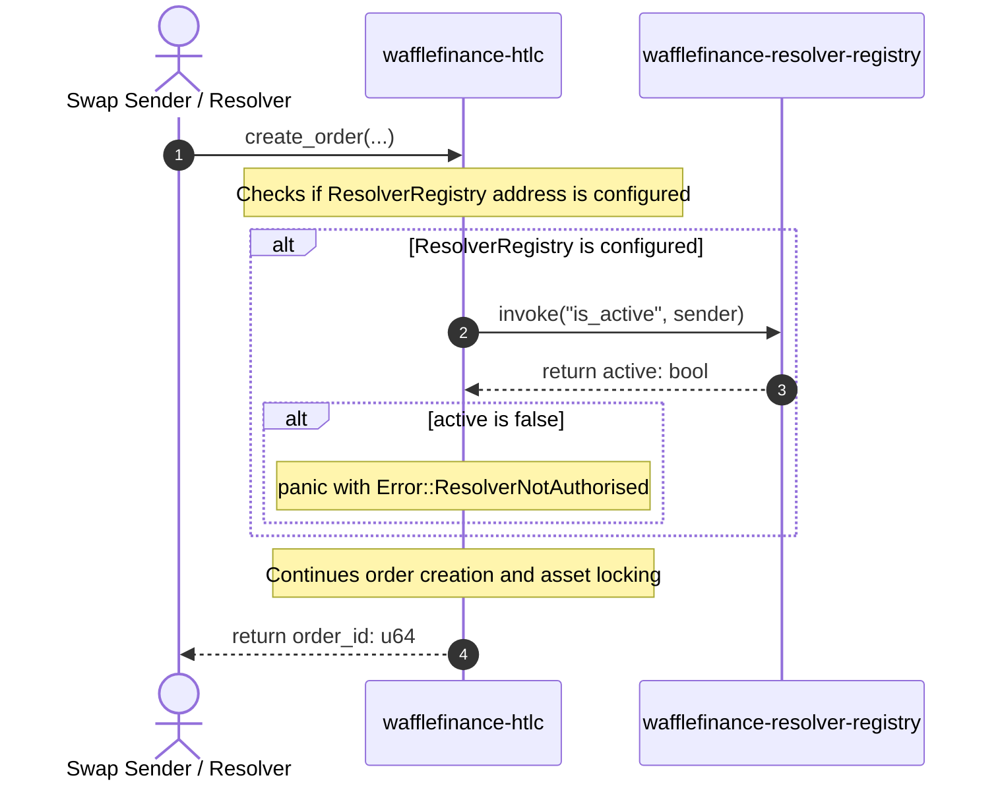

# WaffleFinance Soroban Contracts IDL & Schema Reference

This document provides a formal Interface Definition Language (IDL) specification and on-chain account schema reference for the Soroban smart contracts of the WaffleFinance protocol:
1. `wafflefinance-htlc` (HTLC Contract)
2. `wafflefinance-resolver-registry` (Resolver Registry Contract)

---

## 1. wafflefinance-htlc

The HTLC contract manages atomic cross-chain swaps on the Stellar network. It ensures that locked assets can only be claimed with a valid cryptographic preimage before a timelock, or refunded to the sender after the timelock.

### Data Types

#### `OrderStatus` (enum)
Represents the lifecycle state of a single HTLC order.
```rust
pub enum OrderStatus {
    Funded = 0,    // Locked, preimage not yet revealed
    Claimed = 1,   // Beneficiary claimed by revealing preimage
    Refunded = 2,  // Timelock expired, funds returned to refund_address
}
```

#### `Order` (struct)
Represents a single hash- and time-locked order.
```rust
pub struct Order {
    pub id: u64,                  // Unique order identifier
    pub sender: Address,          // Account that locked the funds and safety deposit
    pub beneficiary: Address,     // Account that can claim by revealing preimage
    pub refund_address: Address,  // Account that receives refunded funds on timeout
    pub asset: Address,           // Token contract address (or native XLM SAC)
    pub amount: i128,             // Locked asset amount (smallest units)
    pub safety_deposit: i128,     // Security/incentive deposit (in stroops / smallest units)
    pub hashlock: BytesN<32>,     // sha256(preimage)
    pub timelock: u64,            // UNIX timestamp (seconds) after which refund is allowed
    pub status: OrderStatus,      // Current lifecycle state of the order
    pub preimage: Bytes,          // Revealed preimage (empty until claim_order)
    pub created_at: u64,          // Ledger timestamp at order creation
    pub finalised_at: u64,        // Ledger timestamp when transitioning to terminal state
}
```

#### `Error` (enum / repr: u32)
```rust
pub enum Error {
    AlreadyInitialised = 1,
    NotInitialised = 2,
    Unauthorized = 3,
    OrderNotFound = 4,
    OrderNotClaimable = 5,
    OrderNotRefundable = 6,
    InvalidPreimage = 7,
    NotExpired = 8,
    Expired = 9,
    InvalidAmount = 10,
    InvalidTimelock = 11,
    SafetyDepositTooSmall = 12,
    ResolverNotAuthorised = 13,
    Overflow = 14,
}
```

### On-Chain Account / Storage Schema (`DataKey`)

| Storage Key | Storage Type | Data Type | Description |
| :--- | :--- | :--- | :--- |
| `DataKey::Admin` | **Instance** | `Address` | Admin address capable of configuring params. |
| `DataKey::NextOrderId` | **Instance** | `u64` | Monotonically increasing counter for order IDs. |
| `DataKey::Order(u64)` | **Persistent** | `Order` | Details of a funded/finalized order. |
| `DataKey::ResolverRegistry` | **Instance** | `Address` | Optional address of the resolver registry contract. |
| `DataKey::MinSafetyDeposit` | **Instance** | `i128` | Minimum safety deposit required to create orders. |

### Entrypoint Functions

#### Admin & Initialization
*   **`initialize(env: Env, admin: Address, min_safety_deposit: i128)`**
    *   *Description:* Initializes the contract instance. Can only be invoked once.
    *   *Authorization:* `admin.require_auth()`
*   **`set_resolver_registry(env: Env, registry: Address)`**
    *   *Description:* Sets the address of the `ResolverRegistry` contract.
    *   *Authorization:* Admin signature required.
*   **`clear_resolver_registry(env: Env)`**
    *   *Description:* Unbinds/removes the `ResolverRegistry` reference.
    *   *Authorization:* Admin signature required.
*   **`set_min_safety_deposit(env: Env, new_minimum: i128)`**
    *   *Description:* Updates the minimum safety deposit.
    *   *Authorization:* Admin signature required.
*   **`set_admin(env: Env, new_admin: Address)`**
    *   *Description:* Transfers the admin role to a new address.
    *   *Authorization:* Admin signature required.

#### Core Actions
*   **`create_order(env: Env, sender: Address, beneficiary: Address, refund_address: Address, asset: Address, amount: i128, safety_deposit: i128, hashlock: BytesN<32>, timelock_seconds: u64) -> u64`**
    *   *Description:* Locks `amount` of `asset` and `safety_deposit` inside the contract. Computes absolute timelock as `ledger.timestamp() + timelock_seconds`. Bumps TTL for the persistent storage entry.
    *   *Authorization:* `sender.require_auth()`
*   **`claim_order(env: Env, order_id: u64, preimage: Bytes, caller: Address)`**
    *   *Description:* Resolves the order, transfers the locked asset to `beneficiary`, and sends `safety_deposit` to `caller`.
    *   *Authorization:* `caller.require_auth()`
*   **`refund_order(env: Env, order_id: u64, caller: Address)`**
    *   *Description:* Refunds `amount` to `refund_address` and sends `safety_deposit` to `caller` after timelock expiration.
    *   *Authorization:* `caller.require_auth()`

#### Read-Only Getters
*   **`get_order(env: Env, order_id: u64) -> Option<Order>`**
*   **`next_order_id(env: Env) -> u64`**
*   **`admin(env: Env) -> Address`**
*   **`min_safety_deposit(env: Env) -> i128`**
*   **`resolver_registry(env: Env) -> Option<Address>`**

### Event Specification

*   **`created` event**
    *   *Topics:* `[Symbol("created"), sender: Address, beneficiary: Address, hashlock: BytesN<32>]`
    *   *Data:* `[order_id: u64, asset: Address, amount: i128, safety_deposit: i128, timelock: u64]`
*   **`claimed` event**
    *   *Topics:* `[Symbol("claimed"), beneficiary: Address, hashlock: BytesN<32>]`
    *   *Data:* `[order_id: u64, caller: Address, preimage: Bytes, amount: i128, safety_deposit: i128]`
*   **`refunded` event**
    *   *Topics:* `[Symbol("refunded"), refund_address: Address, hashlock: BytesN<32>]`
    *   *Data:* `[order_id: u64, caller: Address, amount: i128, safety_deposit: i128]`

---

## 2. wafflefinance-resolver-registry

The Resolver Registry maintains the stake and active status of off-chain resolvers. Staking is required to prevent sybil attacks on the swap coordinator order books.

### Data Types

#### `ResolverInfo` (struct)
Contains staking details and active status for a registered resolver.
```rust
pub struct ResolverInfo {
    pub address: Address,      // Account address of the resolver
    pub stake: i128,           // Currently active stake amount
    pub registered_at: u64,    // Ledger timestamp when registered
    pub last_slash_at: u64,    // Ledger timestamp of the last slash event (0 if none)
    pub total_slashed: i128,   // Cumulative amount of stake slashed
    pub active: bool,          // Flag indicating if resolver is currently active
}
```

#### `Error` (enum / repr: u32)
```rust
pub enum Error {
    AlreadyInitialised = 1,
    NotInitialised = 2,
    Unauthorized = 3,
    ResolverNotFound = 4,
    StakeBelowMinimum = 5,
    InvalidAmount = 6,
    AlreadyRegistered = 7,
    Overflow = 8,
}
```

### On-Chain Account / Storage Schema (`DataKey`)

| Storage Key | Storage Type | Data Type | Description |
| :--- | :--- | :--- | :--- |
| `DataKey::Admin` | **Instance** | `Address` | Admin address capable of slashing resolvers or updating registry parameters. |
| `DataKey::StakeAsset` | **Instance** | `Address` | Token contract address accepted for staking. |
| `DataKey::MinStake` | **Instance** | `i128` | Minimum stake amount needed to register. |
| `DataKey::SlashBeneficiary` | **Instance** | `Address` | Account address receiving slashed stakes. |
| `DataKey::Resolver(Address)` | **Persistent** | `ResolverInfo` | Information entry for a specific resolver address. |
| `DataKey::ResolverList` | **Instance** | `Vec<Address>` | Vector of all registered resolver addresses. |

### Entrypoint Functions

#### Admin & Initialization
*   **`initialize(env: Env, admin: Address, stake_asset: Address, min_stake: i128, slash_beneficiary: Address)`**
    *   *Description:* Initializes the registry config.
    *   *Authorization:* `admin.require_auth()`
*   **`slash(env: Env, resolver: Address, amount: i128)`**
    *   *Description:* Slashes `amount` of stake from `resolver` and transfers it to the `slash_beneficiary`. Disables (`active = false`) the resolver if remaining stake falls below `min_stake`.
    *   *Authorization:* Admin signature required.
*   **`set_min_stake(env: Env, new_minimum: i128)`**
    *   *Description:* Updates minimum stake required for registration.
    *   *Authorization:* Admin signature required.
*   **`set_admin(env: Env, new_admin: Address)`**
    *   *Description:* Transfers admin role to a new address.
    *   *Authorization:* Admin signature required.
*   **`set_slash_beneficiary(env: Env, new_beneficiary: Address)`**
    *   *Description:* Updates the address receiving slashed funds.
    *   *Authorization:* Admin signature required.

#### Core Actions
*   **`register(env: Env, resolver: Address, stake: i128)`**
    *   *Description:* Registers the caller as a resolver by staking `stake` tokens. Appends the resolver's address to the `ResolverList` and records their details.
    *   *Authorization:* `resolver.require_auth()`
*   **`increase_stake(env: Env, resolver: Address, additional: i128)`**
    *   *Description:* Adds `additional` stake amount to the resolver's current stake.
    *   *Authorization:* `resolver.require_auth()`
*   **`unregister(env: Env, resolver: Address)`**
    *   *Description:* Withdraws all current stake, deletes the `ResolverInfo` persistent entry, and removes the address from `ResolverList`.
    *   *Authorization:* `resolver.require_auth()`

#### Read-Only Getters
*   **`is_active(env: Env, resolver: Address) -> bool`**
    *   *Description:* Used by the HTLC contract or off-chain integrations to verify if a resolver has active status.
*   **`get(env: Env, resolver: Address) -> Option<ResolverInfo>`**
*   **`list(env: Env) -> Vec<Address>`**
*   **`min_stake(env: Env) -> i128`**

### Event Specification

*   **`register` event**
    *   *Topics:* `[Symbol("register"), resolver: Address]`
    *   *Data:* `[stake: i128]`
*   **`increase` event**
    *   *Topics:* `[Symbol("increase"), resolver: Address]`
    *   *Data:* `[additional: i128]`
*   **`unreg` event**
    *   *Topics:* `[Symbol("unreg"), resolver: Address]`
    *   *Data:* `[returned_stake: i128]`
*   **`slashed` event**
    *   *Topics:* `[Symbol("slashed"), resolver: Address]`
    *   *Data:* `[slashed_amount: i128]`

---

## 3. Cross-Contract Interaction Flow

When `DataKey::ResolverRegistry` is set on the HTLC contract, the HTLC utilizes dynamic contract invocation to verify resolver status during order creation.


